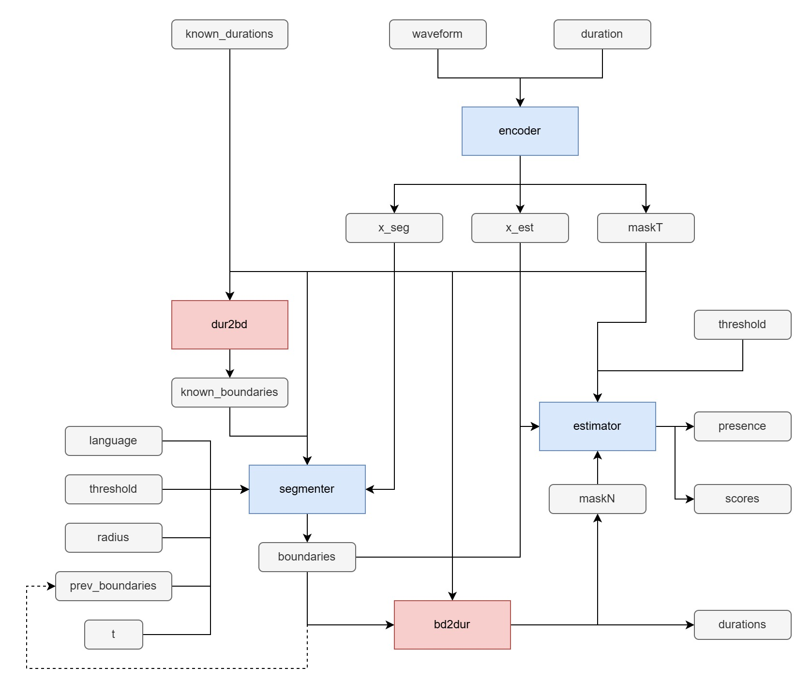

# ONNX Workflow and Structures

## Overview



## Configurations

A `config.json` carries the information needed for ONNX model inference. Structure:

```json5
{
    // Accepted audio sampling rate
    samplerate: 44100,
    // Time step of each frame, in seconds
    timestep: 0.01,
    // Language mapping (null if the model doesn't support languages)
    languages: {
        // 0 = unknown, unset or universal
        // Starting from 1
        en: 1,
        ja: 2,
        zh: 3,
        // ...
    },
    // Whether the model supports D3PM sampling loop
    loop: true,
    // Embedding dim
    embedding_dim: 256,
}
```

## Modules and functions

| name           | description                                                                   |
|:---------------|:------------------------------------------------------------------------------|
| encoder.onnx   | The encoder module. Maps waveforms to latent features.                        |
| segmenter.onnx | The segmenter module. Predicts note boundaries. Supports D3PM sampling loops. |
| estimator.onnx | The estimator module. Estimate note pitches from given boundaries.            |
| dur2bd.onnx    | Function to convert durations in seconds to boundaries in frames.             |
| bd2dur.onnx    | Function to convert boundaries in frames to durations in seconds.             |

## Dimensions

| name | type    | description                       |
|:-----|:--------|:----------------------------------|
| B    | dynamic | Batch size.                       |
| L    | dynamic | Number of waveform samples.       |
| T    | dynamic | Number of feature frames.         |
| N    | dynamic | Number of notes.                  |
| C    | static  | Embedding dim of latent features. |

## Variables

| name             | type    | dtype   | shape     | description                                                                                                                                                                                            |
|:-----------------|:--------|:--------|:----------|:-------------------------------------------------------------------------------------------------------------------------------------------------------------------------------------------------------|
| waveform         | in      | float32 | [B, T]    | Audio waveform.                                                                                                                                                                                        |
| duration         | in      | float32 | [B]       | Waveform duration, in seconds.                                                                                                                                                                         |
| x_seg            | mid     | float32 | [B, T, C] | Latent feature for segmentation.                                                                                                                                                                       |
| x_est            | mid     | float32 | [B, T, C] | Latent feature for estimation.                                                                                                                                                                         |
| maskT            | mid     | bool    | [B, T]    | Mask on frames.                                                                                                                                                                                        |
| known_durations  | in      | bool    | [B, T]    | Known or pre-defined region durations, in seconds. If there are no known regions, use `duration`.                                                                                                      |
| known_boundaries | mid     | bool    | [B, T]    | Known or pre-defined boundaries.                                                                                                                                                                       |
| prev_boundaries  | in/mid  | bool    | [B, T]    | Predicted boundaries of the previous sampling step. For the first sampling step, use `known_boundaries`. Omitted if the model doesn't support D3PM sampling loop.                                      |
| language         | in      | int64   | [B]       | Language ID. 0 is unset or universal. Omitted if the model doesn't support languages.                                                                                                                  |
| threshold (1)    | in      | float32 | scalar    | Boundary decoding threshold. A frame with confidence above this value can be decoded as boundary. Recommended value: 0.2.                                                                              |
| radius           | in      | int64   | scalar    | Boundary decoding radius, in number of frames. A frame with confidence that is local maxima within this radius can be decoded as boundary. Recommended value: 2.                                       |
| t                | in      | float32 | [B]       | The time $t$ of D3PM sampling, where $t=0$ is noise, $t=1$ is the data distribution. Must be within $[0,1)$. Omitted if the model doesn't support D3PM sampling loop.                                  |
| boundaries       | mid     | bool    | [B, T]    | Predicted boundaries. Should be flowed back to `prev_boundaries` during D3PM sampling loops. Can be replaced with `known_boundaries` if all note boundaries are known and the task is estimation-only. |
| maskN            | mid/out | bool    | [B, N]    | Mask on notes. 1 = valid, 0 = padding. Paddings only appear in the ends.                                                                                                                               |
| durations        | out     | float32 | [B, N]    | Predicted note durations, in seconds.                                                                                                                                                                  |
| threshold (2)    | in      | float32 | scalar    | Note presence threshold. A note with confidence above this value is considered as voiced. Recommended value: 0.2.                                                                                      |
| presence         | out     | bool    | [B, N]    | Note presence flags. 1 = voiced, 0 = unvoiced.                                                                                                                                                         |
| scores           | out     | float32 | [B, N]    | Note pitches, in semitones of MIDI scale (A4 = 69).                                                                                                                                                    |
